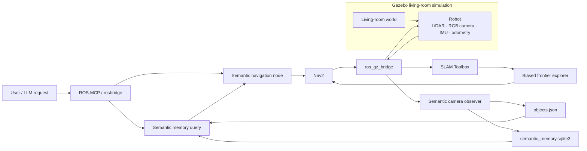
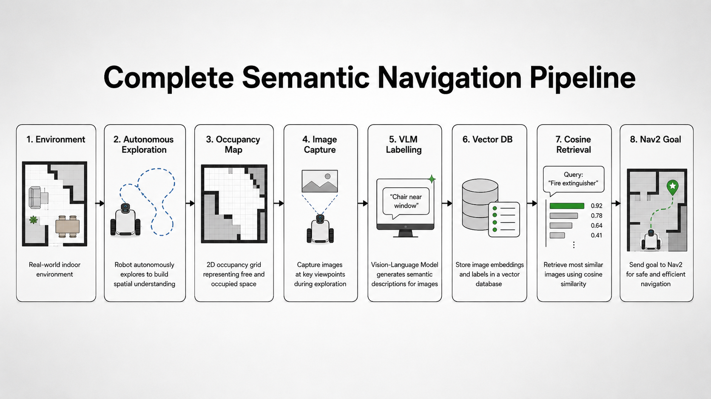
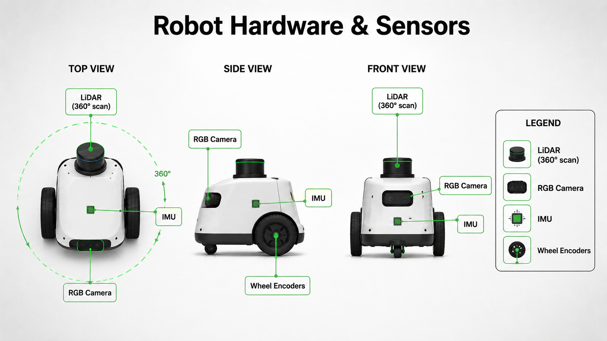
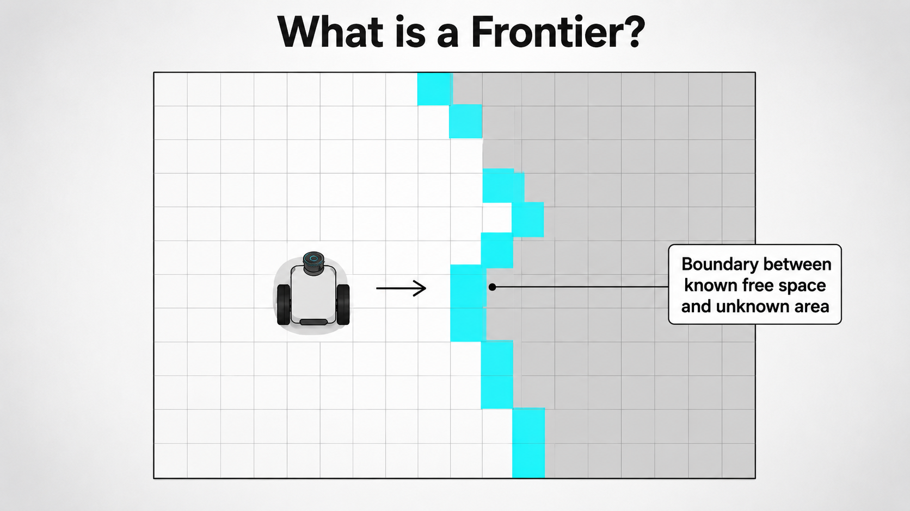
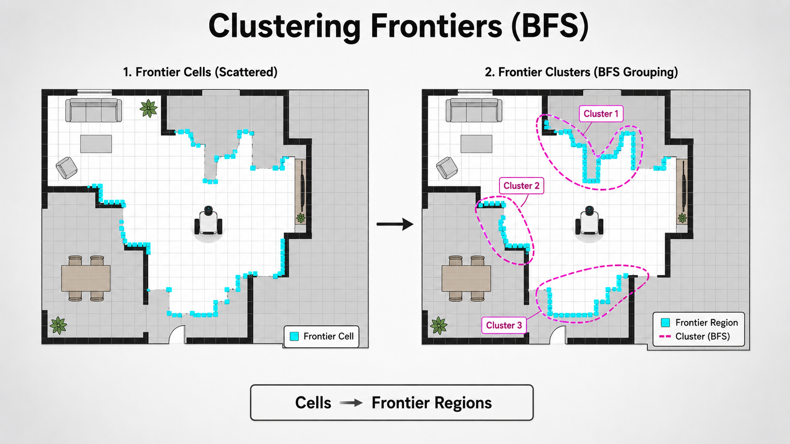
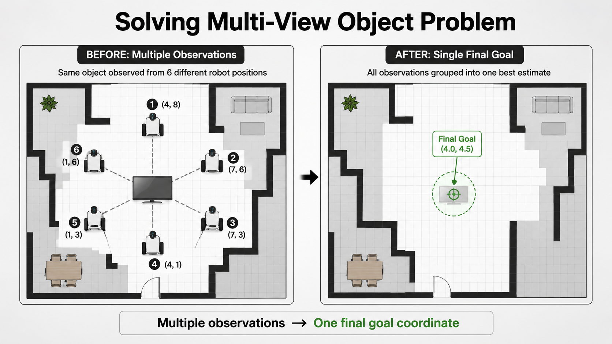
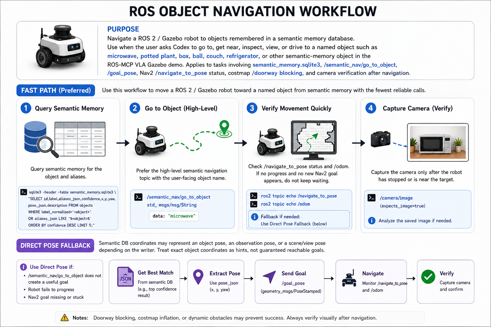

# Semantic Navigation Simulation

This example shows how a mobile robot can explore a living-room simulation, build a semantic memory of what it sees, and later answer natural-language requests such as “go near the plant” by retrieving a remembered viewing pose and sending a deterministic Nav2 goal.

[](https://youtu.be/Cj4dYQ7BuUw)

[Watch the tutorial and demo video](https://youtu.be/Cj4dYQ7BuUw)

## System architecture



At runtime, Gazebo supplies robot sensors, SLAM builds the occupancy map, the frontier explorer chooses where to look next, the camera observer stores labeled captures, and the semantic navigation node turns a language target into a reachable Nav2 goal.



## Visual walkthrough

| Robot sensing | Frontier detection |
| --- | --- |
|  |  |

| Frontier clustering | Object-goal selection |
| --- | --- |
|  |  |



## Project layout

```text
10_semantic_navigation/
├── living_room_world.sdf
├── semantic_navigation.launch.py
├── config/
│   ├── semantic_landmarks.json
│   ├── vla_nav2_params.yaml
│   ├── vla_semantic_nav.rviz
│   └── vla_slam_params.yaml
├── data/
│   ├── objects.json
│   └── semantic_images/
├── images/
├── scripts/
│   ├── biased_frontier_explorer.py
│   ├── odom_tf_broadcaster.py
│   ├── semantic_camera_observer.py
│   ├── semantic_memory_mcp_server.py
│   ├── semantic_memory_node.py
│   ├── semantic_nav_node.py
│   └── semantic_vector_store.py
└── pyproject.toml
```

## Requirements

Tested with Ubuntu 22.04, ROS 2 Humble, Ignition Gazebo Fortress, and `uv`.

```bash
sudo apt update
sudo apt install ros-humble-ros-gz
sudo apt install ros-humble-rosapi ros-humble-rosbridge-server
sudo apt install ros-humble-navigation2 ros-humble-nav2-bringup ros-humble-slam-toolbox
sudo apt install python3-numpy python3-pil

uv venv --python 3.10
source .venv/bin/activate
uv sync
```

ROS 2 Humble is built against Python 3.10, so keep this example’s virtual environment on Python 3.10 as well. Set `OPENAI_API_KEY` for vision labels and embeddings. Without it, the simulation still saves captures and can use the local landmark fallback when enabled.

## Run the simulation

```bash
source /opt/ros/humble/setup.bash
source .venv/bin/activate
ros2 launch semantic_navigation.launch.py
```

Useful launch switches:

```bash
ros2 launch semantic_navigation.launch.py rviz:=false
ros2 launch semantic_navigation.launch.py explore:=false
ros2 launch semantic_navigation.launch.py duration:=600
ros2 launch semantic_navigation.launch.py semantic_observer:=false
ros2 launch semantic_navigation.launch.py semantic_landmark_fallback:=true
```

Runtime data is written to:

```text
data/objects.json
data/semantic_memory.sqlite3
data/semantic_images/
```

## Useful commands

Drive the robot:

```bash
ros2 topic pub /cmd_vel geometry_msgs/msg/Twist \
  "{linear: {x: 0.25}, angular: {z: 0.0}}" --once
```

Bias exploration toward a direction:

```bash
ros2 topic pub /exploration_bias std_msgs/msg/String \
  "{data: '{\"type\":\"direction\",\"heading_deg\":90,\"weight\":2.0,\"ttl_sec\":60}'}" --once
```

Trigger a semantic camera sweep:

```bash
ros2 topic pub /semantic_capture/request std_msgs/msg/String \
  "{data: '{\"request_id\":\"manual_1\",\"reason\":\"manual_check\"}'}" --once
```

Query semantic memory:

```bash
ros2 topic pub /semantic_memory/query std_msgs/msg/String \
  "{data: '{\"query\":\"plant near the wall\",\"top_k\":5}'}" --once
```

Navigate to a remembered object view:

```bash
ros2 topic pub /semantic_nav/go_to_object std_msgs/msg/String \
  "{data: '{\"label\":\"plant\",\"match\":\"best\"}'}" --once
```

## ROS-MCP access

The launch starts `rosbridge_websocket` on port `9090` by default. If that port is busy and fallback is enabled, it chooses the next available port and prints the selected value in the launch output.

You can also expose the SQLite semantic memory directly as an MCP server:

```bash
python3 scripts/semantic_memory_mcp_server.py \
  --vector-store data/semantic_memory.sqlite3
```

## Main topics

```text
/odom
/scan
/imu
/camera/image
/camera/camera_info
/joint_states
/tf
/tf_static
/clock
/map
/semantic_explorer/status
/semantic_capture/status
/semantic_memory/objects
/semantic_memory/query_results
/semantic_memory/status
/semantic_observer/status
/semantic_nav/status
```
