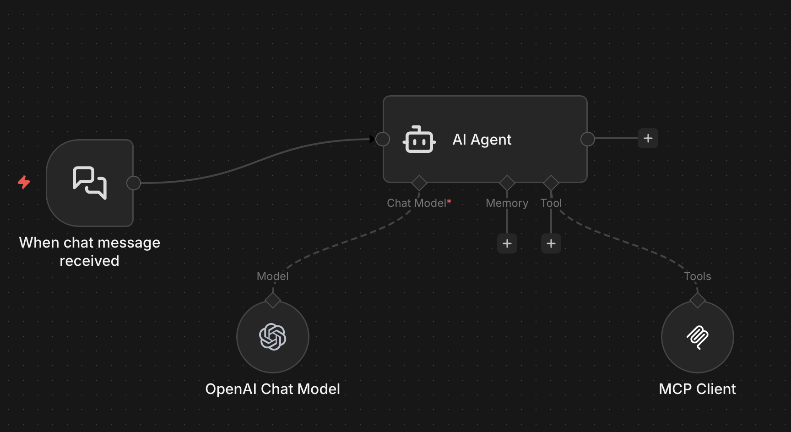
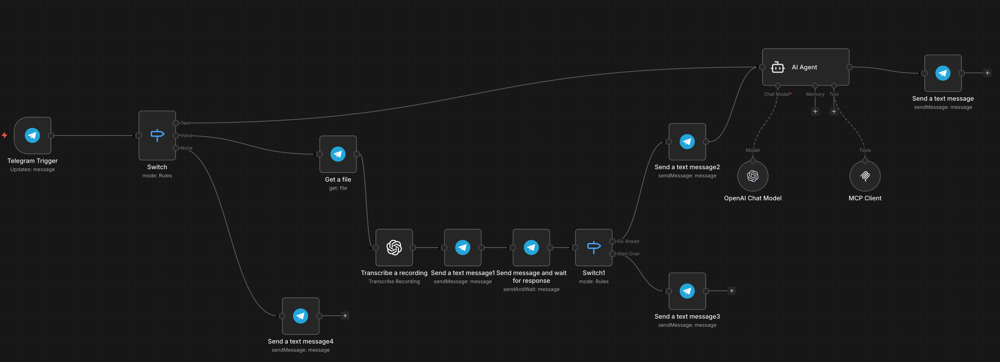

# Example 5: ROS-MCP Server with n8n workflows

This example contains practical demo workflows showing how to integrate **ROS-MCP Server** with **n8n** which is a no-code/low-code automation tool.

These demos enable remote control, monitoring, and voice/text interaction with ROS-based robots (real hardware or simulation like Gazebo/turtlesim) using natural language and AI agents.

## 📋 Tested On

This example has been tested and verified on:

  * **OS:** Ubuntu 22.04 LTS
  * **ROS Distro:** ROS 2 Humble

## Features Demonstrated

- **Part 1**: Basic connection between n8n and ROS-MCP Server using ngrok for secure HTTPS exposure → control robot topics/services from n8n workflows.
- **Part 2**: Telegram bot integration → send text or voice commands to control/monitor the robot remotely via Telegram (with transcription via OpenAI).

## Prerequisites

- ROS 2 installed and sourced
- rosbridge_suite running (`roslaunch rosbridge_server rosbridge_websocket.launch` or ROS2 equivalent)
- Python 3.8+ (for running ROS-MCP server)
- n8n installed (self-hosted or cloud)
- (ngrok)[https://ngrok.com] account
- OpenAI API key (for voice transcription in Part 2)
- Telegram bot token (for Part 2)

## Installation & Setup

1. **Clone this repo**
   ```bash
   git clone https://github.com/robotmcp/demos-ros-mcp-server.git
   cd demos-ros-mcp-server
   ```

2. **Start ROS-MCP Server with Streamable HTTP** (recommended transport for n8n)
   ```bash
   # Make sure rosbridge is running on ws://localhost:9090
   roslaunch rosbridge_server rosbridge_websocket.launch   # ROS1
   # or ros2 launch rosbridge_server rosbridge_websocket_launch.py   # ROS2

   # Start MCP server
   python server.py --transport streamable-http --host 0.0.0.0 --port 8080
   ```
   - Confirm logs show listening at `http://0.0.0.0:8080/mcp` and connected to rosbridge.

3. **Expose via ngrok** (for remote n8n access)
   ```bash
   ngrok http 8080
   ```
   - Copy the HTTPS forwarding URL (e.g., `https://xxxx.ngrok-free.dev`)
   - Full endpoint for n8n: `https://xxxx.ngrok-free.dev/mcp`

4. **Import n8n workflows**
   - Open n8n → Workflows → Import from File/JSON
   - Use the JSON files in this repo:
     - `ROS-MCP.json` → Basic chat/agent integration
     - `ROS-MCP (Telegram Bot).json` → Telegram voice/text bot

5. **Configure n8n MCP Client node**
   - In both workflows, edit the **MCP Client** node:
     - Endpoint URL: `https://<your-ngrok-url>/mcp`
     - Transport: Streamable HTTP
     - Authentication: None
   - Add your OpenAI credentials (for voice transcription in Telegram workflow)
   - Add Telegram bot credentials (token) in the Telegram nodes

## Demo 1: Basic n8n + ROS-MCP Integration



**Goal**: Connect n8n AI Agent to ROS-MCP for robot control/monitoring via chat or triggers.

**Workflow file**: `Part 1: ROS-MCP.json`

**Video Tutorial**:

[](https://youtu.be/sGQMZQPp6RU)

Watch: [Connect ROS-MCP to n8n: Step-by-Step Tutorial](https://youtu.be/sGQMZQPp6RU)

**What it does**:
- AI agent uses MCP tools to list topics, subscribe, publish commands (e.g., move robot), call services.
- Great starting point for custom automation.

## Demo 2: Telegram Voice & Text Robot Control Bot



**Goal**: Build a Telegram bot that lets you control/monitor the robot with text or voice messages.

**Workflow file**: `Part 2: ROS-MCP (Telegram Bot).json`

**Video Tutorial**:
[](https://youtu.be/165aPfm7kS8)

Watch: [Control Robots with Telegram: Build Voice & Text Bot using n8n + ROS-MCP](https://youtu.be/165aPfm7kS8)

**What it does**:
- Handles text and voice inputs (transcribes voice via OpenAI)
- Uses AI agent + MCP to execute ROS commands
- Sends confirmations, status updates, and results back via Telegram
- Includes safety checks and human-readable summaries

## Troubleshooting

- **rosbridge not connecting**: Ensure it's running on port 9090 and set `ROSBRIDGE_HOST=localhost` env var if needed.
- **ngrok URL changes**: Free tier domains are temporary — restart ngrok and update n8n.
- **MCP endpoint 404**: Confirm server logs show `/mcp` path; test with `curl https://<ngrok>/mcp`.
- **Voice transcription fails**: Check OpenAI API key and credits.
- **Firewall/port issues**: Use `--host 0.0.0.0` and allow port 8080 locally.

## Related Resources

- Official ROS-MCP Server: https://github.com/robotmcp/ros-mcp-server (most popular implementation)
- n8n Documentation: https://docs.n8n.io
- MCP Protocol Spec: (search for "Model Context Protocol" docs)
- rosbridge_suite: https://github.com/RobotWebTools/rosbridge_suite

--- 
